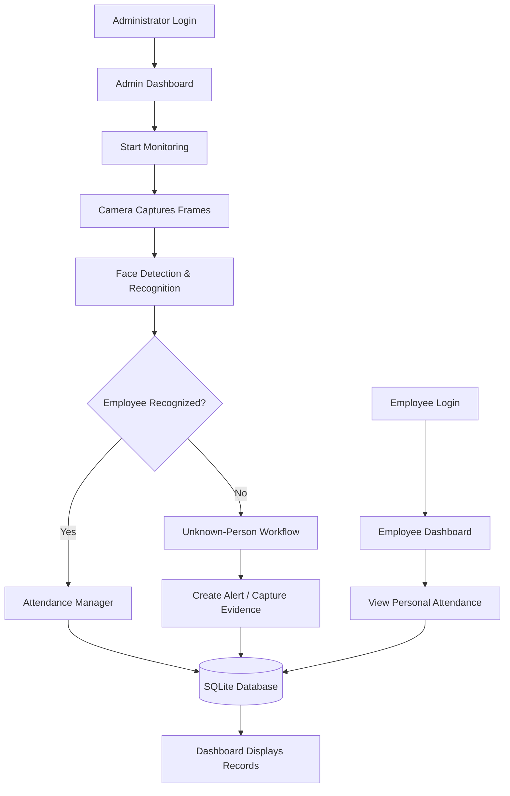

<div align="center">

# 🛡️ AI Surveillance & Smart Attendance System

### Intelligent video monitoring, face recognition, and automated attendance — in one dashboard.

A Python-based surveillance application that combines computer vision, face recognition, attendance management, and evidence tracking with a Streamlit dashboard.


**Real-Time Monitoring · Face Recognition · Automated Attendance · Alerts · Evidence · Analytics**

</div>

---

## 📌 Overview

Traditional attendance and surveillance workflows can depend on manual monitoring, separate tools, and time-consuming record keeping. The **AI Surveillance & Smart Attendance System** aims to bring these tasks together in a centralized application.

The system processes camera frames, attempts to recognize registered employees, records attendance for recognized individuals, and supports alert and evidence workflows for unknown persons. Administrators can use the dashboard to manage monitoring and review system records, while employees can view their own attendance information.

> **Project status:** Academic / development project. Recognition quality and performance depend on camera quality, lighting, face registration data, hardware, and configuration. Validate the system in your own environment before relying on it operationally.

## ✨ Key Features

### 🎥 AI-Powered Surveillance
- Process frames from a connected camera.
- Detect faces and compare them with registered face data.
- Support a live monitoring workflow from the administrator dashboard.
- Start and stop monitoring when required.

### 👤 Employee Registration
- Register employee details.
- Capture face images from different angles and expressions.
- Organize face images by employee.
- Use registered face data for subsequent recognition.

### 🕒 Smart Attendance
- Record attendance for recognized employees.
- Store attendance information in a local database.
- Let employees view their own attendance records.
- Give administrators access to attendance information.

### 🚨 Alerts & Evidence
- Support an unknown-person alert workflow.
- Capture and save evidence images for review.
- Keep alert and evidence information available to the dashboard, depending on the configured implementation.

### 📊 Centralized Dashboard
- Administrator dashboard for surveillance and record review.
- Employee dashboard for personal attendance.
- Attendance, alerts, evidence, and analytics sections where implemented.
- SQLite-backed data storage.

## 🧰 Technology Stack

| Technology | Purpose |
|---|---|
| **Python** | Core application logic |
| **OpenCV** | Camera access and image/video processing |
| **InsightFace** | Face analysis and recognition embeddings |
| **ONNX Runtime** | Inference runtime used by the face-analysis pipeline |
| **Streamlit** | Web-based user interface and dashboards |
| **SQLite** | Local database |
| **Pandas** | Data handling and tabular records |
| **Plotly** | Interactive charts, if enabled in the dashboard |
| **psutil** | Process monitoring/control, if used by the monitoring workflow |

## 🏗️ System Workflow



*The diagram describes the intended high-level workflow. Actual behavior depends on the modules and features enabled in your current codebase.*

## 📁 Project Structure

```text
AI-Surveillance-System/
├── app/
│   ├── recognition/
│   │   ├── face_attendance.py
│   │   ├── register_faces.py
│   │   └── register_employee_camera.py
│   └── attendance/
│       └── attendance_manager.py
├── dashboard/
│   ├── login.py
│   └── pages/
│       ├── admin_dashboard.py
│       └── employee_dashboard.py
├── database/
│   └── surveillance.db
├── faces/          # Registered face images (keep private)
├── evidence/       # Captured evidence images (keep private)
├── models/         # Model assets, if stored locally
├── data/           # Supporting data
├── .venv/          # Local virtual environment (do not upload)
├── .gitignore
└── README.md
```

> Folder and file names may differ slightly in your local version. Update this tree to match the exact contents of your GitHub repository before publishing.

## ⚙️ Installation & Setup

### 1. Prerequisites

- Windows 10/11 (commands below use PowerShell)
- Python installed
- A webcam or supported camera source
- Git (for cloning the repository)

### 2. Clone the repository

Replace `YOUR-USERNAME` and `YOUR-REPOSITORY` with your GitHub details.

```powershell
git clone https://github.com/YOUR-USERNAME/YOUR-REPOSITORY.git
cd YOUR-REPOSITORY
```

### 3. Create and activate a virtual environment

```powershell
python -m venv .venv
.\.venv\Scripts\Activate.ps1
```

If PowerShell blocks activation, you can run the virtual environment's Python directly or adjust your execution policy according to your organization's security guidance.

### 4. Install dependencies

If the repository contains a `requirements.txt` file:

```powershell
python -m pip install --upgrade pip
pip install -r requirements.txt
```

If it does **not** contain a dependency file yet, install the packages required by your code and then create one. Common packages used by this project include:

```powershell
pip install streamlit opencv-python insightface onnxruntime numpy pandas pillow plotly psutil
```

Some packages, model downloads, or inference providers may vary by Python version and hardware. Use a Python version supported by all dependencies in your environment.

### 5. Configure local data

- Ensure the database folder exists.
- Register employees through the application so their details and face data are stored in the expected locations.
- Ensure the camera is connected and available.
- Keep real employee face images, credentials, database files, and surveillance evidence out of public repositories.

### 6. Run the application

From the project root, start the Streamlit login page:

```powershell
python -m streamlit run dashboard/login.py
```

If your project uses a different Streamlit entry point, replace the path with the correct file.

To run the recognition module directly for debugging:

```powershell
python -m app.recognition.face_attendance
```

Run **one monitoring process at a time**. Avoid starting a separate recognition process on every dashboard refresh, as this can use excessive memory or open the camera multiple times.

## 🔐 Privacy & Security

This project may process face images, employee details, attendance records, and surveillance evidence. Handle that data responsibly.

- **Do not commit** face images, evidence images, real databases, passwords, API keys, or personal employee information.
- Use environment variables or a local configuration file excluded from Git for secrets.
- Restrict access to registration, attendance, evidence, and administrative functions.
- Obtain appropriate consent and follow applicable privacy, workplace, and surveillance laws before deploying the system.
- Apply secure password storage and access controls before using the application beyond a local demonstration.
- Treat face recognition as fallible: verify important decisions through an appropriate human review process.

## 🧪 Testing & Evaluation

Before presenting or deploying the project, test at least the following:

- [ ] Valid and invalid login attempts
- [ ] Administrator and employee role access
- [ ] Employee registration and face-image capture
- [ ] Recognition under different lighting and face angles
- [ ] Correct attendance creation and duplicate-entry handling
- [ ] Unknown-person alert and evidence workflow
- [ ] Dashboard attendance and alert records
- [ ] Camera start/stop and recovery after an error
- [ ] Database persistence after restarting the application
- [ ] Logout and access-control behavior

For an academic report, measure results using real experiments. Suitable metrics include recognition accuracy, precision, recall, false-acceptance rate, false-rejection rate, processing speed (FPS), and resource usage. **Do not report estimated values as measured results.**

## 🛣️ Future Improvements

- Liveness detection and anti-spoofing
- Improved handling of low-light and partially occluded faces
- Multi-camera support
- Configurable restricted zones
- More detailed attendance and visitor analytics
- Configurable notifications
- Better audit logging and role-based permissions
- Automated testing and deployment support

## 🎓 Project Purpose

This project demonstrates how computer vision, face recognition, database management, and web dashboards can be integrated into a single application. It can also be used as a basis for Software Engineering documentation, including use-case, activity, class, sequence, communication/collaboration, state, DFD, ER, component, and deployment diagrams.

## 🤝 Contributing

Contributions and suggestions are welcome.

1. Fork the repository.
2. Create a feature branch.
3. Make and test your changes.
4. Submit a pull request with a clear description of the improvement.

For bug reports, include the steps to reproduce the issue and relevant error messages. Do not include real face images, credentials, or private surveillance footage in issue reports.

## 📄 License

No license has been specified yet. Add a `LICENSE` file before allowing others to reuse, modify, or distribute this project. If you choose an open-source license, make sure it matches your intentions and any third-party model or dataset terms.

---

<div align="center">

**Built with Python, computer vision, and a focus on smarter monitoring.**  
⭐ If this project is useful to you, consider giving the repository a star.

</div>
